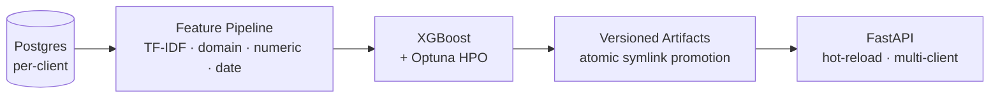
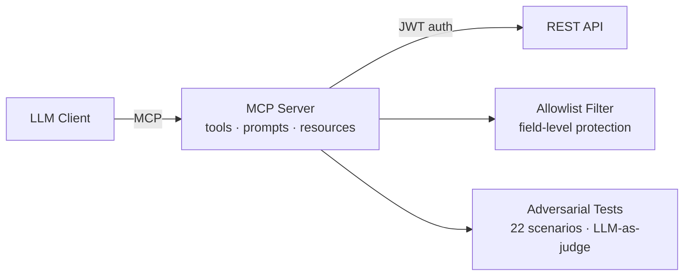
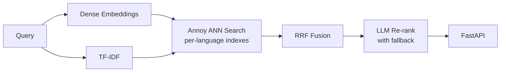

# Nathan Lorber

AI/ML Engineer with 3+ years of experience building production ML and LLM systems end-to-end. Background in Physics (MSc, Strasbourg/CERN) and Data Science (CentraleSupélec).

Currently focused on applied ML, LLM tooling, and AI security.

## Projects

> These projects are anonymized and rewritten versions of systems I built in professional contexts. All proprietary code, data, and company references have been removed. Synthetic data and mock APIs replace the originals.

### [transaction-classifier](https://github.com/nlorber/transaction-classifier)
Multi-class classification system that predicts French accounting codes from financial transaction data. XGBoost with domain-specific feature engineering (entity detection, fiscal period signals, SEPA fields), temporal train/val split, multi-client isolation, and a FastAPI inference API with hot-reload and artifact checksums.

**Python · XGBoost · scikit-learn · FastAPI · Optuna · SHAP**

### [mcp-rest-bridge](https://github.com/nlorber/mcp-rest-bridge)
Production-ready MCP server template for wrapping any REST API as LLM-usable tools, prompts, and resources. Includes JWT auth with auto-refresh, allowlist-based field filtering, dual transport (stdio + HTTP), and a 22-scenario LLM-as-judge adversarial test suite covering prompt injection, privilege escalation, and data isolation attacks.

**TypeScript · MCP · Zod · Vitest · Claude API**

### [hybrid-recsys](https://github.com/nlorber/hybrid-recsys)
Multilingual content recommendation engine combining dual retrieval (dense embeddings + TF-IDF), Reciprocal Rank Fusion, and optional LLM re-ranking with automatic fallback. Per-language Annoy indexes, duration-aware scoring, and a FastAPI serving layer.

**Python · OpenAI embeddings · scikit-learn · Annoy · spaCy · FastAPI**

## Stack

Python · TypeScript · XGBoost · PyTorch · LangChain · RAG · MCP · FastAPI · Docker · Kubernetes · Terraform · Snowflake · dbt · AWS · Azure

*Full professional stack — portfolio projects demonstrate a subset.*

## Contact

[LinkedIn](https://linkedin.com/in/nathan-lorber) · nlorber2211@gmail.com
