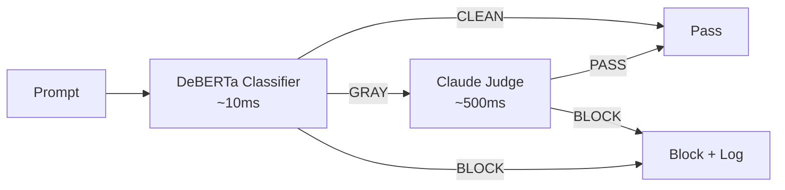
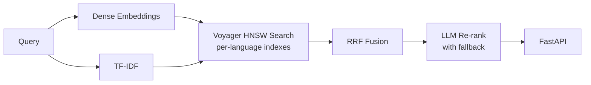
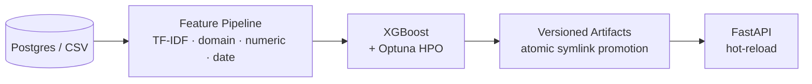

# Nathan Lorber

AI/ML Engineer with 3+ years of experience building production ML and LLM systems end-to-end. Background in Physics (MSc, Strasbourg/CERN) and Data Science (CentraleSupélec).

Currently focused on applied ML, LLM tooling, and AI security.

## Projects

> Architecture and design patterns below are adapted from production systems — synthetic data and mock APIs keep the repos self-contained and runnable without proprietary data. Paths that call an external LLM (e.g. `llm-firewall`'s judge) require an API key; each repo's quick-start lists what is needed.

### [llm-firewall](https://github.com/nlorber/llm-firewall)
Personal project exploring LLM security. Fine-tuned DeBERTa-v3-base classifier for prompt threat detection (injection, jailbreak, exfiltration, escalation) with a LangGraph orchestration layer that routes ambiguous prompts to a Claude LLM judge. The hybrid approach is projected to cut LLM API calls by ~80-90% vs. classifying every prompt with an LLM, since only the ~10-20% gray zone reaches the judge.

Architecture

**Python · PyTorch · HuggingFace Transformers · DeBERTa-v3 · LangGraph · Claude API · SHAP · FastAPI · Docker**

### [hybrid-recsys](https://github.com/nlorber/hybrid-recsys)
Multilingual content recommendation engine combining dual retrieval (dense embeddings + TF-IDF), Reciprocal Rank Fusion, and optional LLM re-ranking with automatic fallback. Per-language Voyager HNSW indexes, duration-aware scoring, and a FastAPI serving layer.

Architecture

**Python · sentence-transformers (local multilingual, pluggable provider ABC) · scikit-learn · Voyager · spaCy · FastAPI**

### [transaction-classifier](https://github.com/nlorber/transaction-classifier)
Multi-class classification system that predicts French accounting codes from financial transaction data. XGBoost with domain-specific feature engineering (entity detection, fiscal period signals, SEPA fields), temporal train/val split, versioned artifacts with atomic symlink promotion, and a FastAPI inference API with hot-reload and artifact checksums.

Architecture

**Python · XGBoost · scikit-learn · FastAPI · Optuna · SHAP**

### [mcp-rest-bridge](https://github.com/nlorber/mcp-rest-bridge)
Production-ready MCP server template for wrapping any REST API as LLM-usable tools, prompts, and resources. Includes JWT auth with auto-refresh, allowlist-based field filtering, dual transport (stdio + HTTP), and a 26-scenario LLM-as-judge adversarial test suite covering prompt injection, privilege escalation, data isolation, and nested-field bypass attacks.

Architecture

**TypeScript · MCP · Zod · Vitest · Claude API**

## Stack

**Portfolio:** Python · TypeScript · PyTorch · XGBoost · scikit-learn · FastAPI · MCP · LangGraph · Zod · Docker · Optuna · spaCy

**Also used professionally:** TensorFlow · LangChain · Kubernetes · Terraform · Snowflake · dbt · AWS · Azure

## Contact

[LinkedIn](https://linkedin.com/in/nathan-lorber) · nlorber2211@gmail.com
